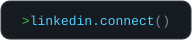
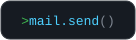
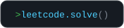
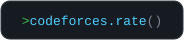
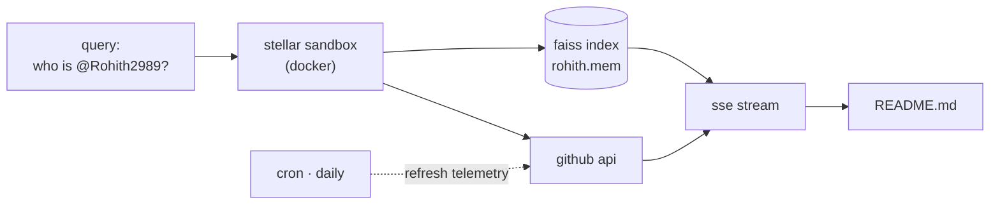

<!-- If you're reading the source: yes, even this comment was compiled. -->

<picture>
  <source media="(prefers-color-scheme: dark)" srcset="assets/agent-trace-dark.svg">
  <source media="(prefers-color-scheme: light)" srcset="assets/agent-trace-light.svg">
  
</picture>

  <a href="https://www.linkedin.com/in/rohith-a-514a7353/">
    <picture>
      <source media="(prefers-color-scheme: dark)" srcset="assets/chip-linkedin-dark.svg">
      <source media="(prefers-color-scheme: light)" srcset="assets/chip-linkedin-light.svg">
      
    </picture>
  </a>
  <a href="mailto:rohith2989@gmail.com">
    <picture>
      <source media="(prefers-color-scheme: dark)" srcset="assets/chip-mail-dark.svg">
      <source media="(prefers-color-scheme: light)" srcset="assets/chip-mail-light.svg">
      
    </picture>
  </a>
  <!-- TODO(rohith): swap in your real LeetCode profile URL — leetcode.com/Rohith2989 does not exist -->
  <a href="https://leetcode.com">
    <picture>
      <source media="(prefers-color-scheme: dark)" srcset="assets/chip-leetcode-dark.svg">
      <source media="(prefers-color-scheme: light)" srcset="assets/chip-leetcode-light.svg">
      
    </picture>
  </a>
  <a href="https://codeforces.com/profile/Rohith2989">
    <picture>
      <source media="(prefers-color-scheme: dark)" srcset="assets/chip-codeforces-dark.svg">
      <source media="(prefers-color-scheme: light)" srcset="assets/chip-codeforces-light.svg">
      
    </picture>
  </a>

<code>$ cat HOW_THIS_WORKS.md</code>

 

This README isn't a template — it's a trace of an agent rendering it.

- The terminal above is a **hand-written animated SVG** — pure CSS keyframes, no JS (GitHub wouldn't run it anyway), no generator sites.
- The numbers in `github.metrics()` are **real** — [telemetry.yml](.github/workflows/telemetry.yml) re-fetches them every day and rewrites the SVG in place.
- Both light and dark theme variants are compiled from one source by [make_light_assets.py](scripts/make_light_assets.py).

<code>last telemetry sync: <!--SYNC-->2026-08-11<!--/SYNC--> · rendered by stellar-runtime · 0 hallucinations detected</code>

